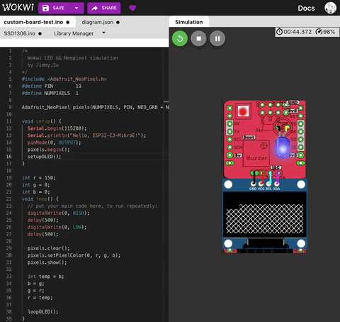

# C3MikroE_Wokwi
Customize C3MikroE for Wokwi simulation

   C3MikroE LED Blinking Simulation
 

   C3MikroE BuiltIn Neopixel Simulation
 

   C3MikroE SSD1306 I2C OLED Simulation
 

   C3MikroE PWM Servo Simulation
 

 

### References
  - [WOKWI Simulation](https://wokwi.com/)
  - [WOKWI Customizing/Loading board](https://github.com/wokwi/wokwi-boards)
